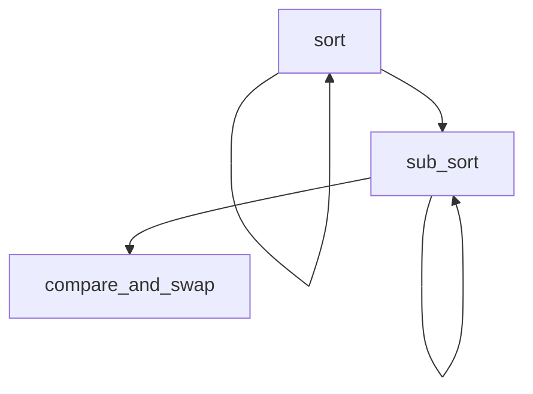
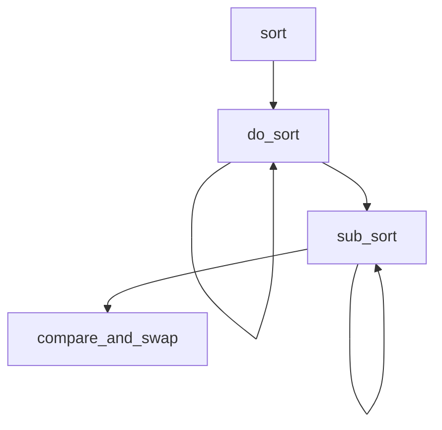

[実践Rust入門を読んでいる(1)](https://ongaeshi.hatenablog.com/entry/2023/01/25/030723) からの続きを読み進める。

Pythonのサンプルスクリプト読んで対話シェルで実行確認。
いよいよ次からRustで書き始める。

Rust Style Guide https://github.com/rust-lang/fmt-rfcs/blob/master/guide/guide.md

## first版



テスト失敗時のメッセージ分かりやすい。配列は行に並べるべき。

```
---- first::tests::sort_u32_ascending stdout ----
thread 'first::tests::sort_u32_ascending' panicked at 'assertion failed: `(left == right)`
  left: `[4, 10, 11, 20, 21, 30, 110, 330]`,
 right: `[4, 10, 11, 20, 20, 21, 30, 110, 331]`', src/first.rs:36:9
```

テスト込みで書けた。

## second版(ジェネリスク対応)
`fn sort<T: Ord>(x: &mut [T], up: bool)`に書き直せば基本OK。

```
# ドキュメントをブラウザから開く
$ rustup doc --std

# エラー時にバックトレースを表示
$ RUST_BACKTRACE=full cargo test

# さらに詳細なバックトレースを表示
$ RUST_BACKTRACE=full cargo test

# エラーメッセージを表示
$ rustc --explain 308
```

引数を列挙型に変更した。列挙型は大分高機能でC++との大きな違い。

second版(列挙対応済み)。



## エラーを返す
戻り値を返すところはセミコロンを省略する、returnがなくてもここが終端だ分かりやすい。

## クロージャ対応
フィールド変数が同じ名前のときは省略形で書けるの面白いね。間違えたときはちゃんとエラーにしてくれる。

```
$ cargo test
   Compiling bitonic-sorter v0.1.0 (/home/ongaeshi/WslCode/bitonic-sorter)
error[E0560]: struct `Student` has no field named `ages`
  --> src/third.rs:59:17
   |
59 |                 ages, // フィールド変数が同じ名前のときは省略形で書ける
   |                 ^^^^ help: a field with a similar name exists: `age`

For more information about this error, try `rustc --explain E0560`.
error: could not compile `bitonic-sorter` due to previous error
```
