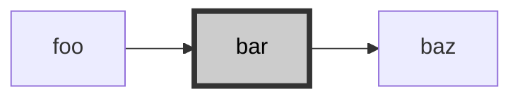
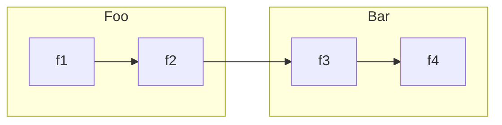
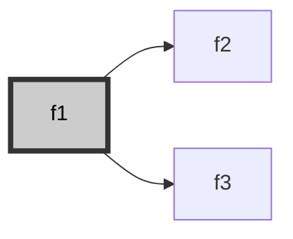
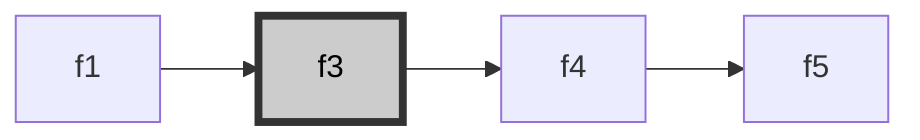
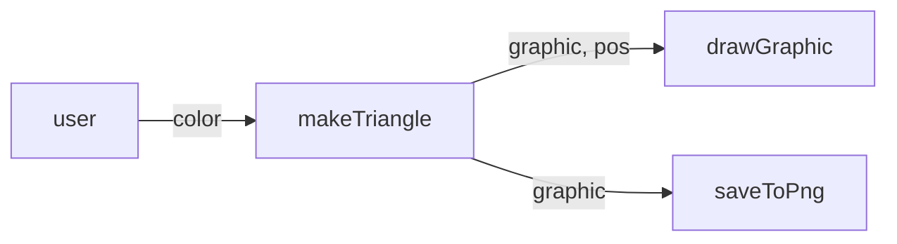
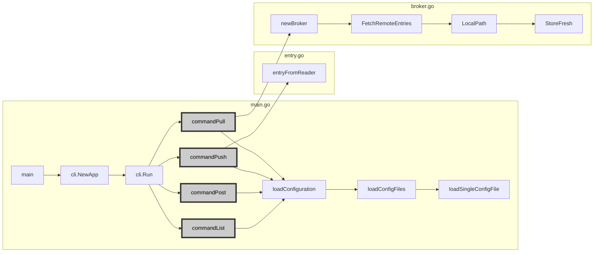

mermaid.js を使ってコードリーディングをするときに便利な機能をまとめてみる。
標準でクラスダイアグラムも使えるが、色々試した結果、応用の効くグラフを使う方法に落ち着いた。

# スタイル
注目させたい関数の色やアウトラインを変更できる。



```
graph LR
  foo --> bar --> baz
  style bar color:#000,fill:#ccc,stroke:#333,stroke-width:4px
```

# サブグラフ
名前空間やファイル名を表すのに便利。



```
graph LR
  subgraph Foo
    f1 --> f2
  end

  f2 --> f3

  subgraph Bar
    f3 --> f4
  end
```

# コメントアウト
`%%` でグラフの一部を無効にすることで1つのグラフを違う視点で表示することができる。  
前述のスタイルと組み合わせるのもよい。

f1 に注目。



```
graph LR
  f1 --> f2
  f1 --> f3
  %% f3 --> f4 --> f5

  style f1 color:#000,fill:#ccc,stroke:#333,stroke-width:4px
  %% style f3 color:#000,fill:#ccc,stroke:#333,stroke-width:4px
```

f3 に注目。



```
graph LR
  %% f1 --> f2
  f1 --> f3
  f3 --> f4 --> f5

  %% style f1 color:#000,fill:#ccc,stroke:#333,stroke-width:4px
  style f3 color:#000,fill:#ccc,stroke:#333,stroke-width:4px
```

# 線にコメント
受け渡されるデータを記述できる。



```
graph LR
  user -- color --> makeTriangle -- graphic, pos --> drawGraphic
  makeTriangle -- graphic --> saveToPng
```

# 開発環境
本家のライブプレビューを使えば大体のものは書ける。
[URL に編集内容が保存される](https://mermaid.live/edit#pako:eNp1jr0KwzAQg1_luDl5AQ-dCl06lDajl8M-EpP4h4vdUkLevXYydxPSJ6ENTbSMCkehNMH9qQNAWVmg78HEJTZxAU8zD-IojAu35KCd6SDF9QCs0Od2mm3hD3-gK715iI8w6oAdehZPztYHWytqzBN71qiqtCSzRh32ylHJ8fUNBlWWwh2WZCnz1VGd9qe5_wDu7UQ_)ので他の人に共有することも可能。

https://mermaid.live/

VSCode だと [Markdown Preview Enhanced](https://marketplace.visualstudio.com/items?itemName=shd101wyy.markdown-preview-enhanced) が png への保存もできるのでおすすめ。

# 実例
[blogsync](https://github.com/x-motemen/blogsync) のコードを読むときに書いたグラフ。灰色になっているのが[各コマンドに対応](https://github.com/x-motemen/blogsync#%E3%82%A8%E3%83%B3%E3%83%88%E3%83%AA%E3%82%92%E3%83%80%E3%82%A6%E3%83%B3%E3%83%AD%E3%83%BC%E3%83%89%E3%81%99%E3%82%8Bblogsync-pull)していてそこから各実装に分散している。設定ファイルの読み書き部分は全コマンド共通。



```
graph LR
  subgraph main.go
    main --> cli.NewApp --> cli.Run

    cli.Run --> commandPull
    cli.Run --> commandPush
    cli.Run --> commandPost
    cli.Run --> commandList

    commandPull --> loadConfiguration
    commandPush --> loadConfiguration
    commandPost --> loadConfiguration
    commandList --> loadConfiguration
    loadConfiguration --> loadConfigFiles --> loadSingleConfigFile    
  end

  commandPull --> newBroker --> FetchRemoteEntries --> LocalPath --> StoreFresh
  commandPush --> entryFromReader
  
  subgraph entry.go
    entryFromReader
  end

  subgraph broker.go
    newBroker
    FetchRemoteEntries
    LocalPath
    StoreFresh
  end

  style commandPull color:#000,fill:#ccc,stroke:#333,stroke-width:4px
  style commandPush color:#000,fill:#ccc,stroke:#333,stroke-width:4px
  style commandPost color:#000,fill:#ccc,stroke:#333,stroke-width:4px
  style commandList color:#000,fill:#ccc,stroke:#333,stroke-width:4px
```
